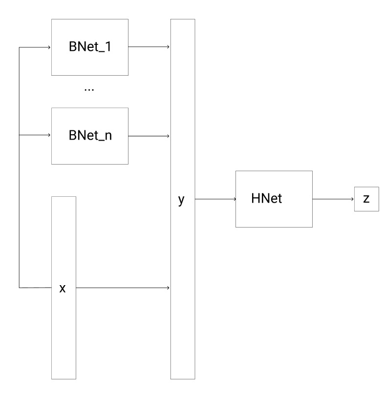

# Прогноз клева на основе AI
Некоторые факторы, которые могут влиять на прогноз клева, не могут быть получены
в процессе скрапинга метеоданных. Предлагается строить ансамбль из нескольких моделей
во главе с крупной нейросетевой моделью из семейства RNN. Данный набор инструментов
предполагает легко масштабирумый процесс добавления новых фичей и моделей в ансамбль.

## Обозначения

Основную модуль в ансамбле будем называть головной сетью (HNet). Модели, которые будут
генерировать фичи будем называть скелетами (BNet). Весь ансамбль моделей назовем 
FNet. 
 
## Архитектура FNet

Предположим, x - базовый входной вектор фичей. С помощью набора моделей вида BNet
мы генерируем фичи и конкатенируем их с вектором y. Общий вектор y подается на вход
головной сети (HNet). На выходе мы получает число z, которое означает вероятность клева.

